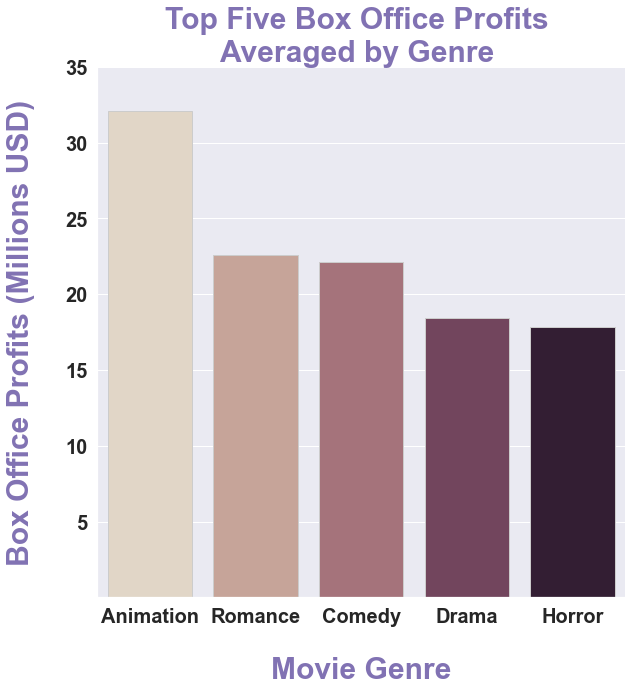
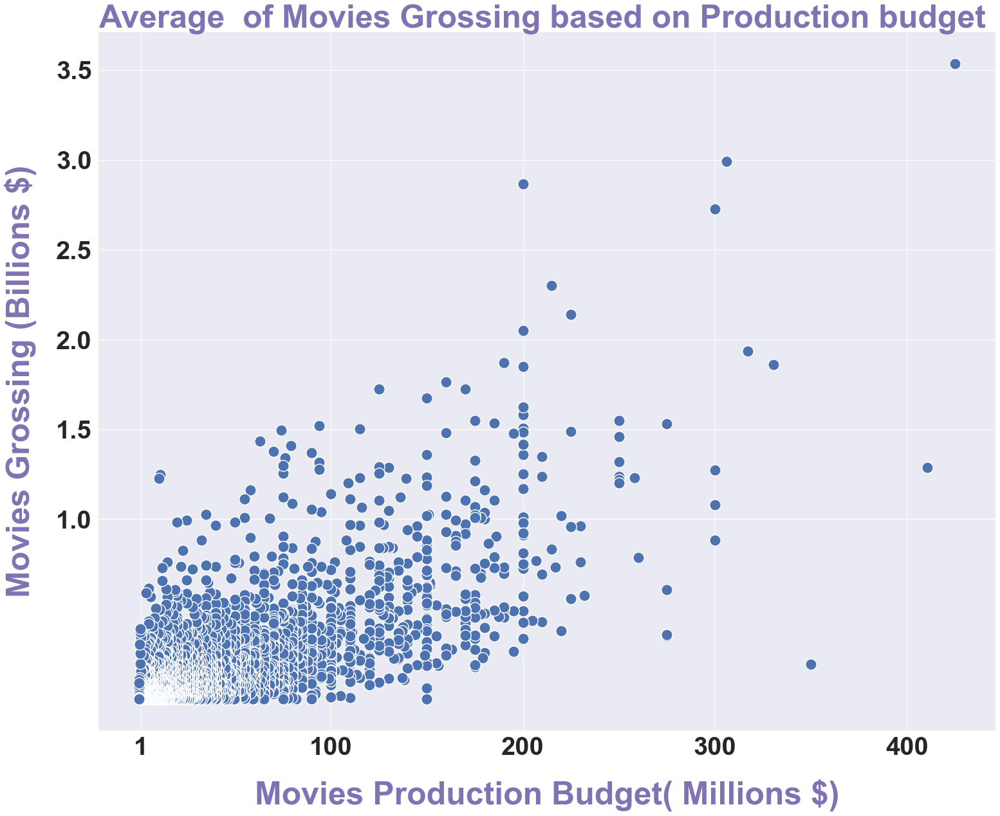
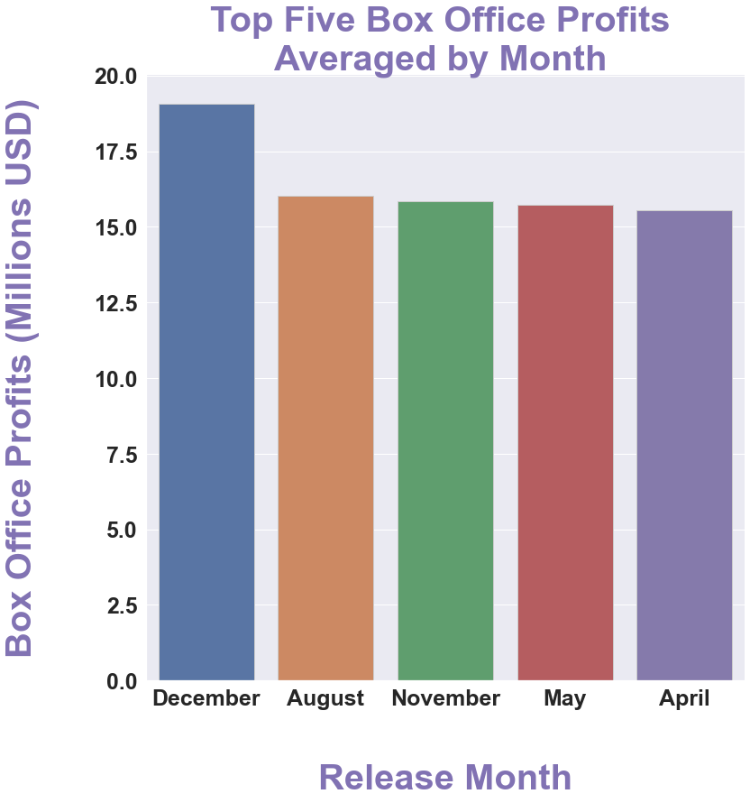

# High Movie's Revinues on Boxoffice

## Project Overview

The goal of this project is to analyze data needs analyzed by Microsoft in order to help them create a movie studio and produce movies that hit the box office.

A descriptive analysis of some movies that have achieved high box office earnings

The outcome data shows three recommendations. Microsoft can use this analysis to decide how to produce a successful movie.

### Business Problem

Microsoft has decided to establish a movie studio and produce movies that hit the box office.

The proposed solution is based on data from the most successful movies at the box office.

A thorough investigation was conducted in order to identify the most effective factors influencing movie revenue.
### The Data Source and Data Exploration

In this project, I work with a dataset, which can be found in the folder zippedData. These are movie datasets from the most popular websites for movie rating: 
* [Box Office Mojo](https://www.boxofficemojo.com/)
* [IMDB](https://www.imdb.com/)
* [Rotten Tomatoes](https://www.rottentomatoes.com/)
* [TheMovieDB](https://www.themoviedb.org/)
* [The Numbers](https://www.the-numbers.com/)

The dataset that I used included variables about :

1-Movie's Genre and Box Office Profits per Each Genre

2: The production budget and how it can affect the movie's gross

3-The month in which the movie is released and how it impacts the box office revenue

### Data Analysis
Through this project,we measure the movie's gross to determine if that movie hits the box office.
by testing 3 factors that affect the movie’s box office revenue.

1. Movie genre

2. The film's production budget

3. The month that the film was released.

I also set three questions to help me analize this data.

### The first question is: What is the average estimation of Box office profits based on Movies Genres?

For the first factor, I looked at what kinds of movies were getting high profits at the box office. I used data from an IMDB database and the Box Office MOJO website.

I looked at which genre had the most movies produced and which genres had the highest average box office profits.

The drama genre produced the most movies, but animation movies had the highest average movie ratings for a genre.

### The second question is: What is the relationship between the movie's gross and the movie's production budget? 

I looked at the dataset from The Numbers, which contained various movies,their production budgets, and their domestic and foreign grosses.

Testing the correlation between production budget and the sum of both (domestic and foreign_gross) found a strong positive relationship, implying that paying more on production budget allows you to earn more on box office.

### The third question is: What is the distribution of Box office profits depending on the month that the movie releases on?

To answer this question, I examined data from Box Office Mojo and the movie database, which contained information about the release date and box office earnings average based on special month.

I found that the highest box office revenue was achieved in December during the Christmas holiday season.

### Methods 
This project uses descriptive and visual analysis, statistical calculations

This provides a useful overview of film industry trends, specifically the factors that contribute to increased box office revenues.

We use some important libraries like (Squlite3),Pandas,Numpy,and Matplotlib in order to analyze the data which was collected from various locations. The different files have different formats. Therefore, we need to load and clean each set of data and then join different sets of them together to get the results.

### Results
We found that:

 Genre,Production Budget,and Movies Release month are all impact the Box office revinues posativally.

1.Genre: The Animation movies achived highest average of box office profits among  other genres ,

2.Production budget: We found postive corelation between the movie's production budget average and the movie's total gross which represents both forgien gross and domestic gross. When the production budget increases the Movie grossing increases as well.
   

3.Movie's released month : I noticed that the highest box office revenue reported on the month of December during the Christmas holiday season.   
  

### Conclusions
This analysis leads to three recommendations for helping Microsoft company to understand the process of producing movies and the factors that affect its profits.

1.Better prediction of the movie's genres that are likely to gain more profit.
This modeling could predict which movie's genre gets the highest profits at the box office.

2.The budget needed to produce a successful movie
This modeling could calculate the average amount of money needed for producing a movie and could achieve more profits.

3.Better estimation of the film's theatrical release time.
 In this model we used already available data, such as the average of box office profits for each month.

### Next Step
Based on the results , our recommendations would be in three areas:

1. Movie's Genre:

Microsoft should pay more attention to the movie's genre, which gains more profits at the box office.

As we found, the movies in the animation genre achieved the highest box office revenues.

The movie should have one of the top five movie genres achieve the highest average of box office profits.

Animation,Romance,Comedy,Drama,Horror.

2.Carfully calculate the production budget.

When the production costs rise, the film becomes more popular and earns more money at the box office.

The average amount of money needed to produce a movie that hits the box office is estimated to be between (100 and 400) million dollars. A film with this budget earns between (1.5-3.5) billion dollars.

3.Microsoft should release their movie in December during the Christmas holiday season,when the box office gains highest profits at that time.

###  Thank you!

Email: mays802004@gmail.com

GitHub: @maysasaad      