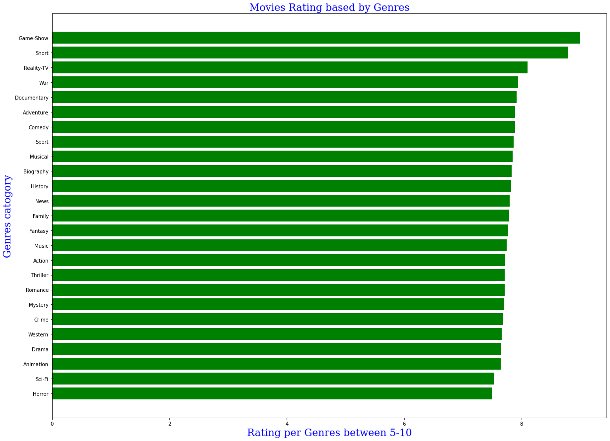
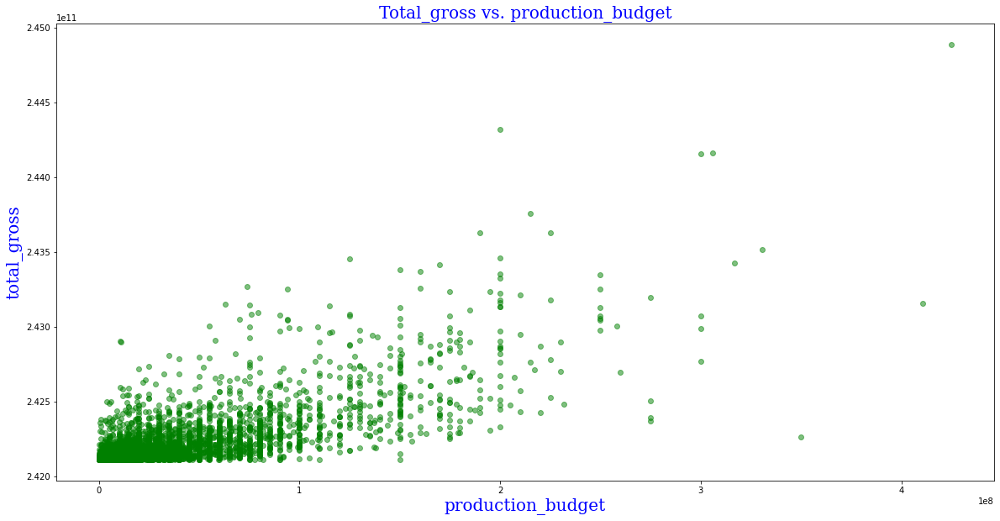
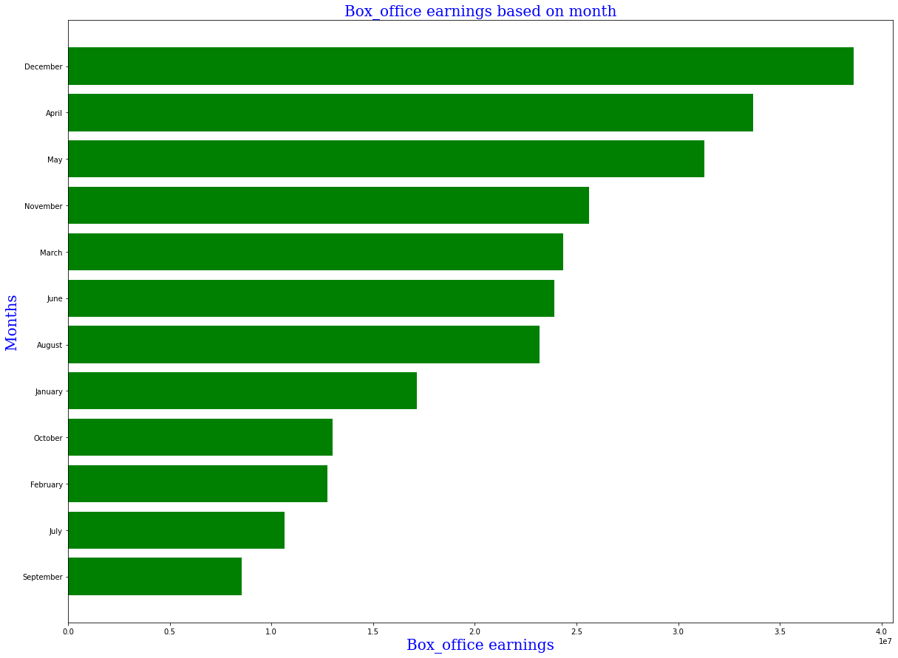

# Highest Grossing Movies

## Project Overview

The goal of this project is to analyze data needs by Microsoft in order to help them to create a movie studio and produce movies that hit the box office.

Descriptive analysis of some movies had achieved high Box office earnings.

The outcome data shows three recommandations, Microsoft can use this analysis to decide how to produce a successful movie.

### Business Problem

Microsoft has decided to establish a movie studio and produce movies  hit the box office.  
The proposed solution is based on data of the most successful movies in box office.
A deep investigation has been done to reveal the most effective factors on the movies revenue

### The Data Source and Data Exploration

In this project, I work with a Dataset, which can be found in the folder `zippedData` are movie datasets from the most popular websites for movies rating:

* [Box Office Mojo](https://www.boxofficemojo.com/)
* [IMDB](https://www.imdb.com/)
* [Rotten Tomatoes](https://www.rottentomatoes.com/)
* [TheMovieDB](https://www.themoviedb.org/)
* [The Numbers](https://www.the-numbers.com/)

The dataset which I used included variables about :

1-Movie's Genre and avarage rating per each genre.

2-The production budget and how it affects the movie's gross.

3- The month which the movie released on and how it impacts the Box office revinues.

### Data Analysis
Through out this project, 3 key factors were focused on that can help determine if a movie does well in the box office:

1. Genre of movie
2. Production budget of film
3. The month which the movie released on .

### 1.Genre of movie
The first question is: What is the distribution of movie rating by genres?
For the first factor, I looked at what kind of movie genres were most popular. I used data from an IMDB database which contained over 85,000 movies along with their ratings.
 I looked at which genre had the most movies produced, and which genres had the highest average rating.
The most produced type of movie was in the Documantary ,The highest average movie ratings for a genre belongs to the Game_show.

### 2. Production Budget
The second question is: What is the distribution of Total gross baed on Production gross?
I took a dataset from The Numbers, which contained various movies,their production budget and their domestic and foreign_gross.
Testing correlation between production budget and sumation of both (domestic and foreign_gross) , found a strong positive relationship between them, which suggests that when you pay more on production budget you can earn more on  box office .

### 3. The month that the movie released on
The third question is: What is the distribution of Box_office baed on release time depends on the movie's released month?
To answer this question, I examined a data from Box Office Mojo which contained informations about the released date and box office earnings avarage based on movies released date.
I found that the highest box office revinues achived on December during the Chrastmas holiday seasons.

### Methods 
This project uses descriptive and visual analysis,Statical calculations 
This provides a useful overview of film industry trends, specifically the factors that contribute to increased box office revinues.

We use some important libraries like (Squlite3,Pandas,Numpy,and Matplotlib)in order to analyze the data which  was collected from various locations, the different files have different formats. Therefore; we need to load ,clean each set of data and then join different sets of them together to get the results.

### Results

1. Genre,Rating,Production Budget,and Month of Release are all impact the Box office            revinues posativally.

2. The Game show genre achived highest rating among other genres ,That means this type of       movies can gain more on the box office.

3. The Standard deviation of the observations shows that data are more spread out
   When production budget is high the Std refears that the data sperate above the mean.
   that means the movie with high production budget saparats widly and hits the box office.
   

4. The month which the movie released on , I noticed that the highest box office revinues 
   reported on the month of December during the Chritmas holiday seasons.   
  

### Conclusions
This analysis leads to three recommendations for helping Microsoft company to understand the process of producing movies and the factors are affected thier profets.

1.Better prediction of the movie's genres that are likely have gain more profets.
This modeling could predict which movie's genre gets highest rate. where is the highest rate means more profits on the box office.

2.The budget needed to produce a sucssussful movie. 
This modeling could predict the average amount of money need for producing a movie can achieve more profits.

3.Better prediction of the movie's release time at the theaters.
This modeling could use already available data, such as the average of box office profits for each month.

### Next Step
1.The movie should contain one of the following genres:
  Game show ,Short ,Reality Tv those are the movies with top rate .

2.Pay more attaintion on the Production budget.
when the production cost increases the movie sperates widly and earns more on the box office.

3.Released the movie during the Holidaies seasons such like ( Christmas,Easter) holidayies on (December,April).

###  Thank you!
Email: mays802004@gmail.com

GitHub: @maysasaad      
