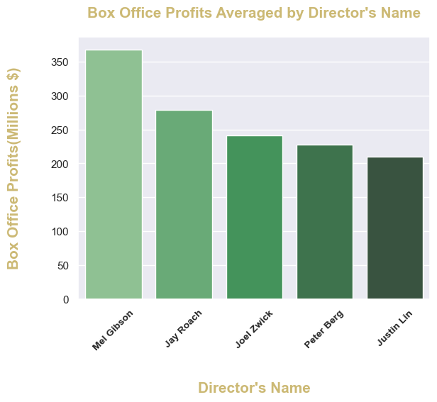
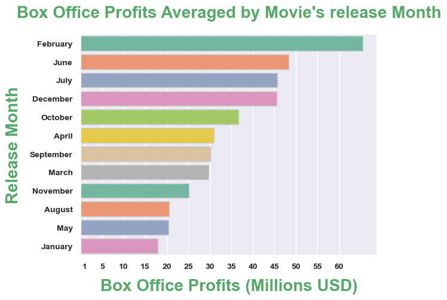

# Box Office Revinues

## Project Overview

The goal of this project is developing a descriptive analysis for some movies that have achieved high box office earnings.These data is  required by Microsoft for establishing a film studio and generating successful box office movies. It includes a detailed analysis of movies that have achieved significant box office revenues. The resulting data offers three valuable recommendations that Microsoft can utilize to make informed decisions on producing prosperous movies.

### Business Problem

Microsoft has made a decision to create its own movie studio with a focus on producing highly successful box office hits.
The proposed solution is based on data from the most successful movies at the box office.
A deep investigation has been done to reveal the most effective factors in the movie's revenues.

### The Data Source and Data Exploration

In this project, I work with a dataset, which can be found in the folder zippedData. These are movie datasets from the most popular websites for movie rating: 
* [Box Office Mojo](https://www.boxofficemojo.com/)
* [IMDB](https://www.imdb.com/)
* [Rotten Tomatoes](https://www.rottentomatoes.com/)
* [TheMovieDB](https://www.themoviedb.org/)
* [The Numbers](https://www.the-numbers.com/)

The final dataset that I used consists of 1236029 rows and 12 columns ,and included movie movie information such as (Title,genre ,runtime,rating ,number of votes,director,release_date,currency,box_office profits,review,critic and publisher)

### Data Analysis

Data Won’t Speak Unless we Ask It The Right Data Analysis Questions .To help transform data into business decisions, we should start preparing the pain points we want to gain insights into.

On our study case here we use descriptive ,statistical calculations and visual analysis to study film industry trends, specifically the factors that contribute to develop a sales strategy and increased box office revenues .We will Measure Movie’s Grossing by testing 3 factors affecting the movie’s revenues, so we will ask these questions :

### The first question is: What is the average estimation of box office profits based on Movies Genres??

### The second question is: What is the relationship between the movie's gross and the movie's Director's name?

### The third question is: What is the distribution of Box office profits depending on the month that the movie releases on?

### Methods 
This project uses descriptive and visual analysis, statistical calculations

This provides a useful overview of film industry trends, specifically the factors that contribute to increased box office revenues.
We use some important libraries like (Squlite3),Pandas,Numpy,and Matplotlib in order to analyze the data which was collected from various locations. The different files have different formats. Therefore, we need to load and clean each set of data and then join different sets of them together to get the results.

### Results

According to the data that we analized above, We found some factors directly affect movie's profits on Box Office:

#### First : Movies Genre

As we can show from the figure below , box office profits increase in some movie genres.

The box office profits were recorded (Romance,Comedy,Animation,Horror,Drama).However, the highest number of produced movies falls under Drama Genre.

#### Second : Director's Name

When we take a look at the figure below , we can notify the postive corelation between the movie's Directos name and the movie's boxoffice profits.
Mel Gibson's films achieved the highest number of box office profits

   

#### Third : Released date

When we take a look at the figure below , we can show the clear relationship between the box office profits based on the month that the movie was released in.The highest profits were reported in February during Valentin's season.

  

### Conclusions
This analysis leads to three recommendations for helping Microsoft company to understand the process of producing movies and the factors that affect its profits.

1.More accurate forecasting of the movie genres most likely to bring in more money Which movie genre receives the highest box office profits

2.Director is an especially important role in the success of a film. director’s reputation can often influence whether the audience go and see a film, or even buy it because they have trust in the director’s style and reputation.

3.More accurate estimation of the film's cinema release time. This model might make use of information that is currently accessible, such as monthly averages for box office revenues.

### Recommendations
Based on the results , our recommendations would be in three areas:

1.Movie's Genre:

Microsoft should pay more attention to the movie genre, which gains more profits at the box office? As we found the movies in the Romance genre achieved the highest box office revenues.

2.Carfully chose the movie's Director:

Microsoft should deal with a famous director who has developed a brilliant reputation over the years and has a broad audience trust, As we found, Mel Gibson gained the highest box office revenues.

3.Movie's released month:

Microsoft should release their movie in February during Valentin's season,when the box office gains highest profits at that time.

###  Thank you!

Email: mays802004@gmail.com

GitHub: @maysasaad   

### Repository Structure

├── data ├── images ├── README.md ├── Presentation.pdf └── Jupyter notebook.ipynb
